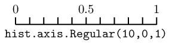
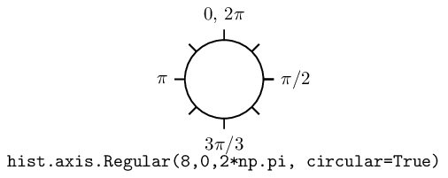
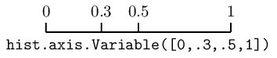
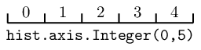
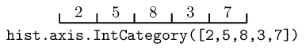

.. _usage-axes:

Axes
====

In hist, a histogram is collection of Axis objects and a
storage. Based on `boost-histogram <https://github.com/scikit-hep/boost-histogram>`_’s
Axis, hist support six types of axis, ``Regular``, ``Boolean``, ``Variable``, ``Integer``, ``IntCategory``
and ``StrCategory`` with additional names and labels.

Axis names
----------

Names are pretty useful for some histogramming shortcuts, thus
greatly facilitate HEP’s studies. Note that the name is the identifier
for an axis in a histogram and must be unique.

.. code-block:: python3

    import hist
    from hist import Hist

.. code-block:: python3

    axis0 = hist.axis.Regular(10, -5, 5, overflow=False, underflow=False, name="A")
    axis1 = hist.axis.Boolean(name="B")
    axis2 = hist.axis.Variable(range(10), name="C")
    axis3 = hist.axis.Integer(-5, 5, overflow=False, underflow=False, name="D")
    axis4 = hist.axis.IntCategory(range(10), name="E")
    axis5 = hist.axis.StrCategory(["T", "F"], name="F")

Histogram’s Axis
----------------

Histogram is consisted with various axes, there are two ways to create a histogram,
currently. You can either fill a histogram object with axes or add axes to a
histogram object. You cannot add axes to an existing histogram. *Note that to distinguish
these two method, the second way has different axis type names (abbr.).*

.. code-block:: python3

    # fill the axes
    h = Hist(axis0, axis1, axis2, axis3, axis4, axis5)

.. code-block:: python3

    # add the axes using the shortcut method
    h = (
        Hist.new.Reg(10, -5, 5, overflow=False, underflow=False, name="A")
        .Bool(name="B")
        .Var(range(10), name="C")
        .Int(-5, 5, overflow=False, underflow=False, name="D")
        .IntCat(range(10), name="E")
        .StrCat(["T", "F"], name="F")
        .Double()
    )

Hist adds a new ``flow=False`` shortcut to axes that take ``underflow`` and ``overflow``.

AxesTuple is a new feature since boost-histogram 0.8.0, which provides you free access to axis properties in a histogram.

.. code-block:: python3

    assert h.axes[0].name == axis0.name
    assert h.axes[1].label == axis1.name  # label will be returned as name if not provided
    assert all(h.axes[2].widths == axis2.widths)
    assert all(h.axes[3].edges == axis3.edges)
    assert h.axes[4].metadata == axis4.metadata
    assert all(h.axes[5].centers == axis5.centers)

Axis types
----------

There are several axis types to choose from.

Regular axis
^^^^^^^^^^^^

.. py:function:: hist.axis.Regular(bins, start, stop, name, label, *, metadata="", underflow=True, overflow=True, circular=False, growth=False, transform=None)
   :noindex:

The regular axis can have overflow and/or underflow bins (enabled by
default). It can also grow if ``growth=True`` is given. In general, you
should not mix options, as growing axis will already have the correct
flow bin settings. The exception is ``underflow=False, overflow=False``, which
is quite useful together to make an axis with no flow bins at all.

There are some other useful axis types based on regular axis:

.. py:function:: hist.axis.Regular(..., circular=True)
   :noindex:

   This wraps around, so that out-of-range values map back into the valid range in a circular fashion.

Regular axis: Transforms
""""""""""""""""""""""""

Regular axes support transforms, as well; these are functions that convert from an external,
non-regular bin spacing to an internal, regularly spaced one. A transform is made of two functions,
a ``forward`` function, which converts external to internal (and for which the transform is usually named),
and a ``inverse`` function, which converts from the internal space back to the external space. If you
know the functional form of your spacing, you can get the benefits of a constant performance scaling
just like you would with a normal regular axis, rather than falling back to a variable axis and a poorer
scaling from the bin edge lookup required there.

You can define your own functions for transforms, see :ref:`usage-transforms`. If you use compiled/numba
functions, you can keep the high performance you would expect from a Regular axis. There are also several
precompiled transforms:

.. py:function:: hist.axis.Regular(..., transform=hist.axis.transform.sqrt)
   :noindex:

   This is an axis with bins transformed by a sqrt.

.. py:function:: hist.axis.Regular(..., transform=hist.axis.transform.log)
   :noindex:

   Transformed by log.

.. py:function:: hist.axis.Regular(..., transform=hist.axis.transform.Power(v))
   :noindex:

   Transformed by a power (the argument is the power).

Variable axis
^^^^^^^^^^^^^

.. py:function:: hist.axis.Variable([edge1, ...], name, label, *, metadata="", underflow=True, overflow=True, circular=False, growth=False)
   :noindex:

   You can set the bin edges explicitly with a variable axis. The options are mostly the same as the Regular axis.

Integer axis
^^^^^^^^^^^^

.. py:function:: hist.axis.Integer(start, stop, name, label, *, metadata="", underflow=True, overflow=True, circular=False, growth=False)
   :noindex:

   This could be mimicked with a regular axis, but is simpler and slightly faster. Bins are whole integers only,
   so there is no need to specify the number of bins.

One common use for an integer axis could be a true/false axis:

.. code-block:: python3

   bool_axis = hist.axis.Integer(0, 2, underflow=False, overflow=False)

Another could be for an IntEnum (Python 3 or backport) if the values are contiguous.

Category axis
^^^^^^^^^^^^^

.. py:function:: hist.axis.IntCategory([value1, ...], name, label, metadata="", growth=False)
   :noindex:

   You should put integers in a category axis; but unlike an integer axis, the integers do not need to be adjacent.

One use for an IntCategory axis is for an IntEnum:

.. code-block:: python3

    import enum

    class MyEnum(enum.IntEnum):
        a = 1
        b = 5

    my_enum_axis = hist.axis.IntEnum(list(MyEnum), underflow=False, overflow=False)

You can sort the Categorty axes via ``.sort()`` method:

.. code-block:: python3

    h = Hist(
        axis.IntCategory([3, 1, 2], label="Number"),
        axis.StrCategory(["Teacher", "Police", "Artist"], label="Profession"),
    )
    # Sort Number axis increasing and Profession axis decreasing
    h1 = h.sort("Number").sort("Profession", reverse=True)

.. py:function:: hist.axis.StrCategory([str1, ...], name, label, metadata="", growth=False)
   :noindex:

   You can put strings in a category axis as well. The fill method supports lists or arrays of strings
   to allow this to be filled.

Manipulating Axes
-----------------

Axes have a variety of methods and properties that are useful. When inside a histogram, you can also access
these directly on the ``hist.axes`` object, and they return a tuple of valid results. If the property or method
normally returns an array, the ``axes`` version returns a broadcasting-ready version in the output tuple.
