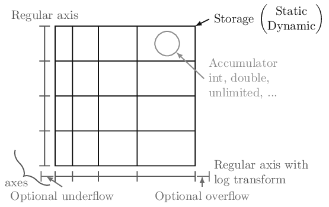
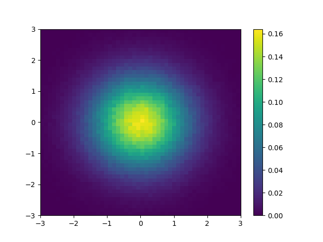

.. _usage-quickstart:

Quickstart
==========

All of the examples will assume the following import:

.. code-block:: python3

   import hist
   from hist import Hist

In boost-histogram, a histogram is collection of Axis objects and a
storage.

Making a histogram
------------------

You can make a histogram like this:

.. code-block:: python3

   h = Hist(hist.axis.Regular(bins=10, start=0, stop=1, name="x"))

If you’d like to type less, you can leave out the keywords for the numbers.

.. code-block:: python3

   h = Hist(hist.axis.Regular(10, 0, 1, name="x"))

Hist also supports a "quick-construct" system, which does not require using anything beyond the ``Hist`` class:

.. code-block:: python3

   h = Hist.new.Regular(10, 0, 1, name="x").Double()

Note that you have to specify the storage at the end (but this does make it easier to use ``Weight`` or other useful storages).

The exact same syntax is used any number of dimensions:

.. code-block:: python3

   hist3D = (
       Hist.new.Regular(10, 0, 100, circular=True, name="x")
       .Regular(10, 0.0, 10.0, name="y")
       .Variable([1, 2, 3, 4, 5, 5.5, 6], name="z")
       .Weight()
   )

See :ref:`usage-axes` and :ref:`usage-transforms`.

You can also select a different storage with the ``storage=`` keyword argument;
see :ref:`usage-storage` for details about the other storages.

Filling a histogram
-------------------

Once you have a histogram, you can fill it using ``.fill``. Ideally, you
should give arrays, but single values work as well:

.. code-block:: python3

   h = Hist(hist.axis.Regular(10, 0.0, 1.0, name="x"))
   h.fill(0.9)
   h.fill([0.9, 0.3, 0.4])

Slicing and rebinning
---------------------

You can slice into a histogram using bin coordinates or data coordinates by
appending a ``j`` to an index. You can also rebin with a number ending in ``j``
in the third slice entry, or remove an entire axis using ``sum``:

.. code-block:: python3

    h = Hist(
        hist.axis.Regular(10, 0, 1, name="x"),
        hist.axis.Regular(10, 0, 1, name="y"),
        hist.axis.Regular(10, 0, 1, name="z"),
    )
    mini = h[1:5, 0.2j:0.9j, sum]
    # Will be 4 bins x 7 bins

See :ref:`usage-indexing`.

.. _accessing-the-contents:

Accessing the contents
----------------------

You can use ``hist.values()`` to get a NumPy array from any histogram. You can
get the variances with ``hist.variances()``, though if you fill an unweighted
storage with weights, this will return None, as you no longer can compute the
variances correctly (please use a weighted storage if you need to). You can
also get the number of entries in a bin with ``.counts()``; this will return
counts even if your storage is a mean storage. See :ref:`usage-plotting`.

If you want access to the full underlying storage, ``.view()`` will return a
NumPy array for simple storages or a RecArray-like wrapper for non-simple
storages.  Most methods offer an optional keyword argument that you can pass,
``flow=True``, to enable the under and overflow bins (disabled by default).

.. code-block:: python3

    np_array = h.view()

Setting the contents
--------------------

You can set the contents directly as you would a NumPy array;
you can set either values or arrays at a time:

.. code-block:: python3

    h[2] = 3.5
    h[hist.underflow] = 0  # set the underflow bin
    hist2d[3:5, 2:4] = np.eye(2)  # set with array

For non-simple storages, you can add an extra dimension that matches the
constructor arguments of that accumulator. For example, if you want to fill
a Weight histogram with three values, you can dimension:

.. code-block:: python3

    h[0:3] = [[1, 0.1], [2, 0.2], [3, 0.3]]

See :ref:`usage-indexing`.

Accessing Axes
--------------

The axes are directly available in the histogram, and you can access
a variety of properties, such as the ``edges`` or the ``centers``. All
properties and methods are also available directly on the ``axes`` tuple:

.. code-block:: python3

   ax0 = h.axes[0]
   X, Y = h.axes.centers

See :ref:`usage-axes`.

Saving Histograms
-----------------

You can save histograms using pickle:

.. code-block:: python3

    import pickle

    with open("file.pkl", "wb") as f:
        pickle.dump(h, f)

    with open("file.pkl", "rb") as f:
        h2 = pickle.load(f)

    assert h == h2

Special care was taken to ensure that this is fast and efficient.  Please use
the latest version of the Pickle protocol you feel comfortable using; you
cannot use version 0, the version that was default on Python 2. The most recent
versions provide performance benefits.

Computing with Histograms
-------------------------

As an complete example, let's say you wanted to compute and plot the density, without using ``.density()``:

.. code-block:: python3

    import functools
    import operator

    import matplotlib.pyplot as plt
    import numpy as np

    import hist

    # Make a 2D histogram
    hist2d = hist.Hist(hist.axis.Regular(50, -3, 3), hist.axis.Regular(50, -3, 3))

    # Fill with Gaussian random values
    hist2d.fill(np.random.normal(size=1_000_000), np.random.normal(size=1_000_000))

    # Compute the areas of each bin
    areas = functools.reduce(operator.mul, hist2d.axes.widths)

    # Compute the density
    density = hist2d.values() / hist2d.sum() / areas

    # Make the plot
    fig, ax = plt.subplots()
    mesh = ax.pcolormesh(*hist2d.axes.edges.T, density.T)
    fig.colorbar(mesh)
    plt.savefig("simple_density.png")

